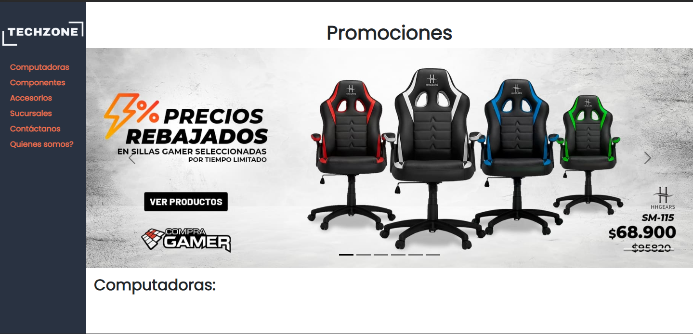
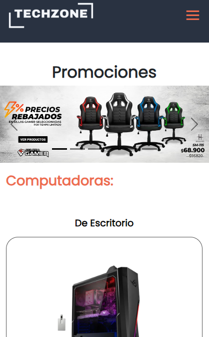

# TechZone - Productos tecnológicos

---

## Website

[TechZone](https://santiagoemanuel.github.io/PreEntrega2MustafaFont/)

---

> ## Proyecto CoderHouse
>
> Página web estática con diseño responsive, navegable y accesible
>
> Utilizando tecnologías aprendidas en el curso, además de la libertad de usar librerías que nos permitan mejorar la calidad de nuestro proyecto.
>
>
> ### Tecnologías utilizadas
>
> - [x] HTML
> - [x] CSS
> - [x] SCSS
> - [x] BootsTrap
> - [x] JavaScript
> - [x] Git
> - [x] GitHub

---

### Desktop view

### Mobile view

